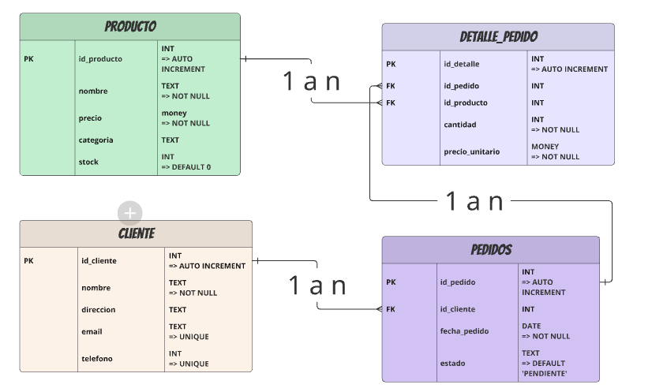

# Auditoría Individual – BRYAN DAVID MUÑOZ DIAZ – Opción B
## snippet de SQL
```sql
CREATE TABLE pedido(
id INT,
cliente TEXT,
producto TEXT,
precio_unitario TEXT,
cantidad TEXT,
total_pedido TEXT,
direccion_cliente TEXT
);
CREATE TABLE catalogo(
nombre_producto TEXT,
precio TEXT,
categoria TEXT,
stock TEXT
);
```
## DESARROLLO

### 1. Snippet con anotaciones:
```sql
CREATE TABLE pedido(
id INT, 
cliente TEXT, -- ERROR: normalizacion (falta FK) e integridad
producto TEXT,
precio_unitario TEXT, -- ERROR: mala variable (money)
cantidad TEXT, -- ERROR: mala variable (int)
total_pedido TEXT, -- ERROR: mala variable (int)
direccion_cliente TEXT
);
CREATE TABLE catalogo(
nombre_producto TEXT, -- ERROR: normalización (falta PK) e integridad
precio TEXT, -- ERROR: mala variable (money)
categoria TEXT, -- ERROR: mala variable (int) y normalización (deberia ser un FK) e integridad
stock TEXT -- ERROR: mala variable (int)
);
```
### 2. Hallazgos y riesgos:

1. Falta de claves primarias y foráneas
No se especifican claves primarias (PRIMARY KEY) ni relaciones entre tablas (FOREIGN KEY), lo que puede provocar:
   - Duplicación de datos
   - Dificultad para hacer joins
   - Pérdida de integridad referencial
* Ejemplo: producto en pedido debería referenciar nombre_producto en catalogo.

2. Redundancia de datos
Campos como precio_unitario y total_pedido podrían calcularse dinámicamente en lugar de almacenarse, para evitar inconsistencias.

3. Nombres poco normalizados
   - nombre_producto y producto deberían tener el mismo nombre si se van a relacionar.
   - precio_unitario y precio también podrían unificarse si representan lo mismo

4. Falta de normalización
Toda la información del cliente está en el mismo registro del pedido. Sería mejor tener una tabla cliente con sus datos, y que pedido solo lo referencie.

5. No hay validación de datos
Al usar TEXT para casi todo, no puedes controlar fácilmente:
   - Que cantidad sea un número positivo
   - Que precio_unitario tenga formato decimal válido
   - Que direccion_cliente no esté vacía
* Esto puede llevar a errores lógicos y datos corruptos.

6. Dificultad para hacer análisis o reportes
Al no tener tipos numéricos ni relaciones claras:
   - No puedes sumar ventas por producto o cliente fácilmente
   - No puedes calcular el stock restante con precisión
   - No puedes hacer filtros avanzados (por categoría, rango de precios, o otros valores).

7. Problemas de rendimiento
Si la base crece, usar TEXT para campos numéricos:
   - Aumenta el tamaño de almacenamiento
   - Ralentiza búsquedas, ordenamientos y cálculos

8. No hay control de duplicados
Sin claves primarias ni restricciones:
   - Puedes tener el mismo pedido dos veces
   - Puedes tener productos duplicados en el catálogo
   - Puedes tener inconsistencias entre pedidos y productos

9. No hay trazabilidad ni auditoría
No hay campos como:
   - fecha_pedido
   - estado_pedido
   - usuario_creador
* Esto impide saber cuándo se hizo un pedido, quién lo gestionó, si fue entregado, etc.

10. No hay control de stock en tiempo real
El campo stock está en catalogo, pero no se actualiza automáticamente al hacer un pedido. Esto puede causar:
- Sobreventa de productos
- Inconsistencias entre lo vendido y lo disponible

11. No hay normalización de cliente
Toda la info del cliente está en cada pedido. Si el cliente hace 10 pedidos, su dirección se guarda 10 veces. Esto:
    - Duplica datos
    - Aumenta el riesgo de errores
    - Complica actualizaciones

12. No hay seguridad ni cifrado
Si esta base se usa en producción:
    - direccion_cliente debería estar protegida
    - No hay control de acceso ni roles definidos
    - No hay encriptación de datos sensibles

13. No hay soporte para múltiples productos por pedido
Cada pedido parece tener solo un producto. ¿Qué pasa si un cliente compra 3 productos distintos en un solo pedido? No está contemplado.

14. No hay internacionalización
Si algún día vendes en varios países:
    - No hay campo para moneda
    - No hay campo para idioma
    - No hay soporte para formatos regionales

### 3. Propuesta de modelo de BBDD para ECOMMERCE

* Tabla clientes(PK: id_cliente => INT, nombre => TEXT, direccion => TEXT, email => TEXT, telefono => int).
* Tabla productos(PK: id_producto => INT, nombre => TEXT, precio => MONEY, categoria => TEXT, stock => INT).
* Tabla pedidos(PK: id_pedido => INT, FK: id_cliente => INT, fecha_pedido => DATE, estado => TEXT).
* Tabla detalle_pedido(PK: id_detalle => INT, FK: id_pedido => INT, FK: id_producto => INT, cantidad => INT, precio_unitario => MONEY)


[Visualización de diagrama de BBDD para una ECOMMERCE](https://miro.com/app/board/uXjVJcsFXQE=/?moveToWidget=3458764638497930537&cot=14)

### 4. Restriccones propuestas (**NEGRITA**)
* Tabla clientes(PK: id_cliente => INT **AUTO_INCREMENT**, nombre => TEXT **NOT NULL**, direccion => TEXT, email => TEXT **UNIQUE**, telefono => int **UNIQUE**)
* Tabla productos(PK: id_producto => INT **AUTO_INCREMENT**, nombre => TEXT **NOT NULL**, precio => MONEY **NOT NULL**, categoria => TEXT, stock => INT **DEFAULT 0**)
* Tabla pedidos(PK: id_pedido => INT **AUTO_INCREMENT**, FK: id_cliente => INT, fecha_pedido => DATE **NOT NULL**, estado => TEXT **DEFAULT 'PENDIENTE'**)
* Tabla detalle_pedido(PK: id_detalle => INT **AUTO_INCREMENT**, FK: id_pedido => INT, FK: id_producto => INT, cantidad => INT **NOT NULL**, precio_unitario => MONEY **NOT NULL**)

### 5. Consultas de validación
* Clientes sin pedidos
```sql
SELECT c.id_cliente, c.nombre
FROM clientes c
LEFT JOIN pedidos p ON c.id_cliente = p.id_cliente
WHERE p.id_pedido IS NULL;
```

Verifica si hay clientes registrados que nunca han hecho un pedido.

* Productos sin stock
```sql
SELECT nombre, stock
FROM productos
WHERE stock <= 0;
```

Detecta productos agotados o mal registrados.

* Pedidos sin detalles
```sql
SELECT p.id_pedido, p.fecha_pedido
FROM pedidos p
LEFT JOIN detalle_pedido d ON p.id_pedido = d.id_pedido
WHERE d.id_detalle IS NULL;
```

Encuentra pedidos que no tienen productos asociados.
